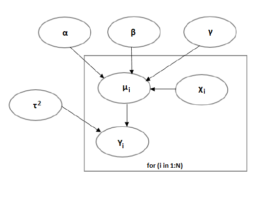
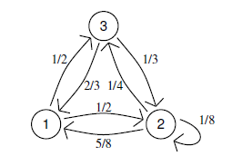

```{r setup, include=FALSE}
knitr::opts_chunk$set(echo = TRUE)
```

## Your Last+First Name __Tsardanidis__Iason__ Your Matricola __1846834__

1a)  Illustrate the characteristics of the statistical model for dealing with the *Dugong*'s data. Lengths ($Y_i$)  and  ages ($x_i$) of  27 dugongs ([see cows](https://en.wikipedia.org/wiki/Dugong)) captured off the coast of Queensland have been recorded and the
  following (non linear)  regression model is considered in [Carlin and Gelfand (1991)](http://people.ee.duke.edu/~lcarin/Gelfand91.pdf):
\begin{eqnarray*}
Y_i &\sim& N(\mu_i, \tau^2) \\
\mu_i=f(x_i)&=& \alpha - \beta \gamma^{x_i}\\
\end{eqnarray*}
Model parameters are
$\alpha \in (1, \infty)$,
$\beta \in (1, \infty)$,
$\gamma \in (0,1)$,
$\tau^2 \in (0,\infty)$. 
Let us consider the following prior distributions:
\begin{eqnarray*}
\alpha &\sim&  Normal(0,\sigma^2_{\alpha})\\
\beta  &\sim&  Normal(0,\sigma^2_{\beta}) \\
\gamma &\sim&  Uniform(0,1)\\
\tau^2 &\sim&  InverseGamma(a,b)
\end{eqnarray*}


1b)  Derive the corresponding likelihood function

1c)  Write down the expression of the joint prior distribution of the parameters at stake and illustrate your suitable choice for the hyperparameters.

1d)  Derive the functional form  (up to proportionality constants) of all *full-conditionals*

1e)  Which distribution can you recognize within standard parametric
  families
so that direct simulation from full conditional can be easily implemented ?

1f)  Using a suitable Metropolis-within-Gibbs algorithm simulate a Markov chain 
($T=10000$) to approximate the posterior distribution for the above model

1g)  Show the 4 univariate trace-plots of the simulations of each parameter

1h)  Evaluate graphically the behaviour of the empirical averages 
$\hat{I}_t$  with growing $t=1,...,T$

1i)  Provide estimates for each parameter together with the
  approximation error and explain how you have evaluated such error

1l)  Which parameter has the largest posterior uncertainty? How did
  you measure it?

1m)  Which couple of parameters has the largest correlation (in
  absolute value)?

1n)  Use the Markov chain to approximate the posterior predictive 
distribution of the length
  of a dugong with age of 20 years.

1o)  Provide the prediction of a different dugong with age 30 

1p)  Which prediction is less precise?

\newpage

(*write your answers and provide your R code for the numerical solution*)

\vspace{0.3cm}
**1a)**
We can illustrate  Dugongs dataset using the prior distributions as follows:


```{r, out.width = "400px",fig.align='center'}

```

As next step we can load the dataset and we can see graphically the relation between the two variables of Length and Age:
```{r,out.width = "500px",fig.align='center'}
df=read.csv("dugong-data.txt",sep=",")
n = dim(df)
x = df$Age
y = df$Length

plot(x,y, xlab = "Age", ylab = "Length", 
     main = "Dugongs - Asymptotic (Non Linear) Regression Model",
     pch = 21,cex = 1.3,bg = 'gray')
```

It will follow a **nonconjugate** Bayesian analysis of the dugongs data set.

\vspace{0.3cm}
**1b)**
The likelihood function can be derived as:

$$L(Y|\alpha,\beta,\gamma,\tau^2,X)
=\prod_{i=1}^n \frac{1}{(2\pi\tau^2)^\frac{1}{2}} \cdot exp \left \{ -\frac{(y_i-\mu_i)^2}{2\tau^2} \right\} \mathbb{I}_{(1,\infty)}(\alpha)\mathbb{I}_{(1,\infty)}(\beta)\mathbb{I}_{(0,1)}(\gamma)\mathbb{I}_{(0,\infty)}(\tau^2)$$
$$L(Y|\alpha,\beta,\gamma,\tau^2,X)
=\frac{1}{(2\pi\tau^2)^\frac{n}{2}} \cdot exp \left\{ -\frac{1}{2\tau^2}\sum_{i=1}^n(y_i-\mu_i)^2 \right \} \mathbb{I}_{(1,\infty)}(\alpha)\mathbb{I}_{(1,\infty)}(\beta)\mathbb{I}_{(0,1)}(\gamma)\mathbb{I}_{(0,\infty)}(\tau^2)$$
$$=\frac{1}{(2\pi\tau^2)^\frac{n}{2}} \cdot exp \left \{-\frac{1}{2\tau^2}\sum_{i=1}^n(y_i-\alpha+\beta\gamma^{x_i})^2 \right \}
\mathbb{I}_{(1,\infty)}(\alpha)\mathbb{I}_{(1,\infty)}(\beta)\mathbb{I}_{(0,1)}(\gamma)\mathbb{I}_{(0,\infty)}(\tau^2)$$


\vspace{0.3cm}
**1c)**
Before derive the expression of the joint prior distribution, we need to compute in advance the prior of each parameter:

$\alpha$ prior:

$$\pi(\alpha) = \frac{1}{\sqrt{ 2\pi\sigma^2_\alpha}} exp \left\{-\frac{\alpha^2}{2\sigma^2_\alpha} \right \}\mathbb{I}_{(1,\infty)}(\alpha) \propto exp \left\{-\frac{\alpha^2}{2\sigma^2_\alpha} \right \} \mathbb{I}_{(1,\infty)}(\alpha)$$
$\beta$ prior:

$$\pi(\beta) = \frac{1}{\sqrt{ 2\pi\sigma^2_\beta}} exp \left\{-\frac{\beta^2}{2\sigma^2_\beta} \right \} \mathbb{I}_{(1,\infty)}(\beta) \propto exp \left\{-\frac{\beta^2}{2\sigma^2_\beta} \right \} \mathbb{I}_{(1,\infty)}(\beta)$$

$\gamma$ prior:

$$\pi(\gamma) = \mathbb{I}_{(0,1)}(\gamma)$$

$\tau^2$ prior:

$$\pi(\tau^2) = \frac{b^a}{\Gamma(a)} \tau^{{2}^{(-a-1)}} exp \left\{-\frac{b}{\tau^2} \right \} \mathbb{I}_{(0,\infty)}(\tau^2) \propto \tau^{{2}^{(-a-1)}} exp \left\{-\frac{b}{\tau^2} \right \}\mathbb{I}_{(0,\infty)}(\tau^2)$$

Finally the joint prior can be obtained as:
$$\pi(\alpha,\beta,\gamma,\tau^2) = \pi(\alpha) \pi(\beta) \pi(\gamma) \pi(\tau^2) = \frac{1}{\sqrt{ 2\pi\sigma^2_\alpha}} exp \left\{-\frac{\alpha^2}{2\sigma^2_\alpha} \right \} \cdot \frac{1}{\sqrt{ 2\pi\sigma^2_\beta}} exp \left\{-\frac{\beta^2}{2\sigma^2_\beta} \right \} \cdot \mathbb{I}_{(0,1)}(\gamma)  \cdot \frac{b^a}{\Gamma(a)} \tau^{{2}^{(-a-1)}} exp \left\{-\frac{b}{\tau^2} \right \}$$
$$\propto exp \left\{-\frac{\alpha^2}{2\sigma^2_\alpha} \right \} \cdot exp \left\{-\frac{\beta^2}{2\sigma^2_\beta} \right \} \cdot \mathbb{I}_{(0,1)}(\gamma) \cdot \tau^{{2}^{(-a-1)}} exp \left\{-\frac{b}{\tau^2} \right \}$$

For the parameters: $\sigma^2_\alpha$, $\sigma^2_\beta$, $a$ and $b$, We chose as more appropriate values: $\sigma^2_\alpha=10000$, $\sigma^2_\beta=10000$, $a=0.001$ and $b=0.001$

$$\alpha \sim N(0, \sigma^2_\alpha) \Longrightarrow \alpha \sim N(0, 10000)$$
$$\beta \sim N(0, \sigma^2_\beta) \Longrightarrow \beta \sim N(0, 10000)$$
$$\gamma \sim Unif(0,1)$$
$$\tau^2 \sim IG(a,b) \Longrightarrow \tau^2 \sim IG(0.001,0.001)$$


\vspace{0.3cm}
**1d)**
Full conditional for $\alpha$:
$$\pi(\alpha|\beta,\gamma,\tau^2,X,Y) = \frac{L(Y|\alpha,\beta,\gamma,\tau^2,X)\pi(\alpha)}{f(Y)} \propto L(Y|\alpha,\beta,\gamma,\tau^2,X)\pi(\alpha)$$ 
$$\propto \frac{1}{(2\pi\tau^2)^\frac{n}{2}} \cdot exp \left \{-\frac{1}{2\tau^2}\sum_{i=1}^n(y_i-\mu_i)^2 \right \} \frac{1}{\sqrt{ 2\pi\sigma^2_\alpha}} exp \left\{-\frac{\alpha^2}{2\sigma^2_\alpha} \right \} \mathbb{I}_{(1,\infty)}(\alpha)$$
$$\propto \frac{1}{(2\pi\tau^2)^\frac{n}{2}} \cdot exp \left \{-\frac{1}{2\tau^2}\sum_{i=1}^n(y_i-\alpha+\beta\gamma^{x_i})^2 \right \} \frac{1}{\sqrt{ 2\pi\sigma^2_\alpha}} exp \left\{-\frac{\alpha^2}{2\sigma^2_\alpha} \right \} \mathbb{I}_{(1,\infty)}(\alpha)$$
$$\propto exp \left \{-\frac{1}{2\tau^2}\sum_{i=1}^n(y_i-\alpha+\beta\gamma^{x_i})^2 \right \} exp \left\{-\frac{\alpha^2}{2\sigma^2_\alpha} \right \} \mathbb{I}_{(1,\infty)}(\alpha) \propto exp \left \{ -\frac{\alpha^2}{2\sigma^2_\alpha} -\frac{\sum_{i=1}^n(\alpha^2-2\alpha y_i-2\alpha\beta\gamma^{x_i})}{2\tau^2}   \right \} \mathbb{I}_{(1,\infty)}(\alpha)$$
$$\propto exp \left \{ -\frac{\alpha^2(\tau^2+n\sigma^2_\alpha)-2\alpha\sigma^2_\alpha\sum_{i=1}^n (y_i+\beta\gamma^{x_i})}{2\sigma^2_\alpha \tau^2}\right \} \mathbb{I}_{(1,\infty)}(\alpha) \propto exp \left \{ -\frac{\alpha^2}{2} \cdot \frac{\tau^2+n\sigma^2_\alpha}{\sigma^2_\alpha \tau^2}+\alpha\cdot \frac{\sigma^2_\alpha\sum_{i=1}^n (y_i+\beta\gamma^{x_i})}{\sigma^2_\alpha \tau^2}\right \} \mathbb{I}_{(1,\infty)}(\alpha)$$
$$\Longrightarrow \pi(\alpha|\beta,\gamma,\tau^2,X,Y) \sim N_{(1,\infty)} \left(\frac{\sigma^2_\alpha\sum_{i=1}^n (y_i+\beta\gamma^{x_i})}{\tau^2+n\sigma^2_\alpha},\frac{\sigma^2_\alpha \tau^2}{\tau^2+n\sigma^2_\alpha} \right)$$

Full conditional for $\beta$:
$$\pi(\beta|\alpha,\gamma,\tau^2,X,Y) = \frac{L(Y|\alpha,\beta,\gamma,\tau^2,X)\pi(\beta)}{f(Y)} \propto L(Y|\alpha,\beta,\gamma,\tau^2,X)\pi(\beta)$$
$$\propto \frac{1}{(2\pi\tau^2)^\frac{n}{2}} \cdot exp \left \{-\frac{1}{2\tau^2}\sum_{i=1}^n(y_i-\mu_i)^2 \right \} \frac{1}{\sqrt{ 2\pi\sigma^2_\beta}} exp \left\{-\frac{\beta^2}{2\sigma^2_\beta} \right \} \mathbb{I}_{(1,\infty)}(\beta)$$
$$\propto \frac{1}{(2\pi\tau^2)^\frac{n}{2}} \cdot exp \left \{-\frac{1}{2\tau^2}\sum_{i=1}^n(y_i-\alpha+\beta\gamma^{x_i})^2 \right \} \frac{1}{\sqrt{ 2\pi\sigma^2_\beta}} exp \left\{-\frac{\beta^2}{2\sigma^2_\beta} \right \} \mathbb{I}_{(1,\infty)}(\beta)$$
$$\propto exp \left \{-\frac{1}{2\tau^2}\sum_{i=1}^n(y_i-\alpha+\beta\gamma^{x_i})^2 \right \} exp \left\{-\frac{\beta^2}{2\sigma^2_\beta} \right \} \mathbb{I}_{(1,\infty)}(\beta) \propto exp \left \{ -\frac{\beta^2}{2\sigma^2_\beta} -\frac{\sum_{i=1}^n(\beta^2\gamma^{2x_i}-2\beta y_i \gamma^{x_i}-2\alpha\beta\gamma^{x_i})}{2\tau^2}   \right \} \mathbb{I}_{(1,\infty)}(\beta)$$
$$\propto exp \left \{ -\frac{\beta^2(\tau^2+\sigma^2_\beta\sum_{i=1}^n \gamma^{2x_i})-2\beta\sigma^2_\beta\sum_{i=1}^n (\alpha\gamma^{x_i}-y_i \gamma^{x_i})}{2\sigma^2_\beta \tau^2}\right \} \mathbb{I}_{(1,\infty)}(\beta)$$ 
$$\propto exp \left \{ -\frac{\beta^2(\tau^2+\sigma^2_\beta\sum_{i=1}^n \gamma^{2x_i})-2\beta\sigma^2_\beta\sum_{i=1}^n \gamma^{x_i}(\alpha-y_i)}{2\sigma^2_\beta \tau^2}\right \} \mathbb{I}_{(1,\infty)}(\beta)$$
$$\propto exp \left \{ -\frac{\beta^2}{2} \cdot \frac{\tau^2+\sigma^2_\beta\sum_{i=1}^n \gamma^{2x_i}}{\sigma^2_\beta \tau^2}+\beta\cdot \frac{\sigma^2_\beta\sum_{i=1}^n \gamma^{x_i}(\alpha-y_i)}{\sigma^2_\beta \tau^2}\right \} \mathbb{I}_{(1,\infty)}(\beta)$$
$$\Longrightarrow \pi(\beta|\alpha,\gamma,\tau^2,X,Y) \sim N_{(1,\infty)} \left(\frac{\sigma^2_\beta\sum_{i=1}^n \gamma^{x_i}(\alpha-y_i)}{\tau^2+\sigma^2_\beta\sum_{i=1}^n \gamma^{2x_i}},\frac{\sigma^2_\beta \tau^2}{\tau^2+\sigma^2_\beta\sum_{i=1}^n \gamma^{2x_i}} \right)$$

Full conditional for $\gamma$:
$$\pi(\gamma|\alpha,\beta,\tau^2,X,Y) = \frac{L(Y|\alpha,\beta,\gamma,\tau^2,X)\pi(\gamma)}{f(Y)} \propto L(Y|\alpha,\beta,\gamma,\tau^2,X)\pi(\gamma)$$
$$\propto \frac{1}{(2\pi\tau^2)^\frac{n}{2}} \cdot exp \left \{-\frac{1}{2\tau^2}\sum_{i=1}^n(y_i-\mu_i)^2 \right \} \mathbb{I}_{(0,1)}(\gamma)$$
$$\propto \frac{1}{(2\pi\tau^2)^\frac{n}{2}} \cdot exp \left \{-\frac{1}{2\tau^2}\sum_{i=1}^n(y_i-\alpha+\beta\gamma^{x_i})^2 \right \} \mathbb{I}_{[0,1]}(\gamma) \propto exp \left \{-\frac{1}{2\tau^2}\sum_{i=1}^n(y_i-\alpha+\beta\gamma^{x_i})^2 \right \} \mathbb{I}_{(0,1)}(\gamma)$$
$$\Longrightarrow \pi(\gamma|\alpha,\beta,\tau^2,X,Y) \sim exp \left \{-\frac{1}{2\tau^2}\sum_{i=1}^n(y_i-\alpha+\beta\gamma^{x_i})^2 \right \} \mathbb{I}_{(0,1)}(\gamma)$$
Full conditional for $\tau^2$:

$$\pi(\tau^2|\alpha,\beta,\gamma,X,Y) = \frac{L(Y|\alpha,\beta,\gamma,\tau^2,X)\pi(\tau^2)}{f(Y)} \propto L(Y|\alpha,\beta,\gamma,\tau^2,X)\pi(\tau^2)$$

$$\propto \frac{1}{\tau^{2\left(\frac{n}{2}\right)}\tau^{2(a+1)}}exp \left \{\frac{-\frac{1}{2}\sum_{i=1}^n(y_i-\alpha+\beta\gamma^{x_i})^2 -b}{\tau^2} \right \} \mathbb{I}_{(0,\infty)}(\tau^2)$$
$$\frac{1}{\tau^{2\left(\frac{n}{2}+a+1\right)}}exp \left \{-\frac{b+\frac{1}{2}\sum_{i=1}^n(y_i-\alpha+\beta\gamma^{x_i})^2}{\tau^2} \right \} \mathbb{I}_{[0,1]}(\tau^2)$$
$$\Longrightarrow \pi(\tau^2|\alpha,\beta,\gamma,X,Y) \sim IG_{(0,\infty)}\left(a+\frac{n}{2}, b+\frac{1}{2}\sum_{i=1}^n(y_i-\alpha+\beta\gamma^{x_i})^2\right)$$

\vspace{0.3cm}
**1e)**
The parameters $\alpha,\beta,\tau^2$ have their own full conditional within standard parametric families - Normal for $\alpha$ and $\beta$, and InverseGamma for $\tau^2$. As a result direct simulation can be implemented easily. On the other hand for the parameter $\gamma$ we don't have a standard parametric family, so an implementation of Metropolis-Hastings algorithm recommended as more suitable.

\vspace{0.3cm}
**1f)**

Using the values of $\sigma^2_\alpha,\sigma^2_\beta,a,b$ suggested in previous steps: 

```{r,fig.align='center'}

library(invgamma)

#simulation size
nsim = 50000

alpha = rep(NA, nsim)
beta = rep(NA, nsim)
gamma = rep(NA, nsim)
tau_squared = rep(NA, nsim)

#hyperparameters
a = b = 0.001
sigma_alpha = sigma_beta = 10000

# initial state for each parameter
alpha[1] = 3
beta[1] = 2
gamma[1] = 0.5
tau_squared[1] = 0.05

# full conditional gamma
full_cond_gamma = function(gamma, alpha, beta, tau_squared) {
  return(exp(-1/(2*tau_squared)*sum((y-alpha+beta*gamma^x)^2)))
}

for(t in 2:nsim) {
  # update alpha Markov chain through Gibbs sampling
  alpha[t] = rnorm(1,(sigma_alpha*sum(y+beta[t-1]*gamma[t-1]^x))/
                     (n*sigma_alpha+tau_squared[t-1]),
                     sqrt((tau_squared[t-1]*sigma_alpha)/
                            (n*sigma_alpha + tau_squared[t-1])))
  
  # update beta Markov chain through Gibbs sampling
  beta[t] = rnorm(1,(sigma_beta*sum((alpha[t]-y)*gamma[t-1]^x))/ 
                    (sigma_beta*sum(gamma[t-1]^(2*x))+tau_squared[t-1]),
                    sqrt((tau_squared[t-1]*sigma_beta)/
                           (sigma_beta*sum(gamma[t-1]^(2*x))+tau_squared[t-1])))

  # Metropolis-Hastings to update gamma Markov chain
  unifa = 0.2
  gamma_prop = gamma[t-1] + runif(1,min=-unifa,max=unifa) 
  greekpi = full_cond_gamma(gamma_prop, alpha[t], beta[t], tau_squared[t-1])/
    full_cond_gamma(gamma[t-1], alpha[t], beta[t], tau_squared[t-1]) 
  omega=runif(1,min=0,max=1)
  ACCEPT=(log(omega)<log(greekpi))
  gamma[t] = ifelse(ACCEPT, gamma_prop, gamma[t-1])

  # update tau square markov chain through Gibbs sampling
  tau_squared[t] = rinvgamma(1, n/2 + a, 
                              b+1/2*sum((y-alpha[t]+beta[t]*(gamma[t]^x))^2))

}
MC = cbind(alpha,beta, gamma, tau_squared)
head(MC)
```

\vspace{0.3cm}
**1g)**
```{r,fig.align='center'}
# Show the 4 univariate trace-plots of the simulations of each parameter

par(mfrow=c(2,2))
plot(alpha, xlab = "iterations", main="alpha trace plot",type="l")
plot(beta, xlab = "iterations", main="beta trace plot",type="l")
plot(gamma, xlab = "iterations", main="gamma trace plot",type="l")
plot(tau_squared, xlab = "iterations", main="tau Square trace plot",type="l")
```

\vspace{0.3cm}
**1h)**
We have to note that the empirical average *converges* to the mean of the whole Markov chain while $t$ becomes bigger...
```{r,fig.align='center',out.width = "500px"}
par(mfrow=c(1,2))

#alpha
hist(alpha,breaks=80, main= "alpha histogram", xlab = "alpha",
     col='orchid',xlim=c(2.2,3.2))
abline(v=mean(alpha), col="red",lwd=2)
plot(cumsum(alpha)/(1:length(alpha)), type="l",ylim = c(2, 3), ylab="alpha", 
     main="behaviour empirical average", xlab="simulations",lwd=2,col='blue')
abline(h=mean(alpha), col="red",lwd=1)

#beta
hist(beta,breaks=80, main= "beta histogram", xlab = "beta",
     col='orchid',xlim=c(0.5,2))
abline(v=mean(beta), col="red",lwd=2)
plot(cumsum(beta)/(1:length(beta)), type="l", ylab="beta", 
     main="behaviour empirical average", xlab="simulations",lwd=2,col='blue')
abline(h=mean(beta), col="red",lwd=1)

#gamma
hist(gamma,breaks=80, main= "gamma histogram", xlab = "gamma",
     col='orchid',xlim=c(0.6,1))
abline(v=mean(gamma), col="red",lwd=2)
plot(cumsum(gamma)/(1:length(gamma)), type="l", ylab="gamma", 
     main="behaviour empirical average", xlab="simulations",lwd=2,col='blue')
abline(h=mean(gamma), col="red",lwd=1)

#tau square
hist(tau_squared,breaks=80, main= "tau squared histogram", xlab = "tau squared",
     col='orchid',xlim=c(0,0.04))
abline(v=mean(tau_squared), col="red",lwd=2)
plot(cumsum(tau_squared)/(1:length(tau_squared)), type="l", ylab="tau_squared", 
     main="behaviour empirical average", xlab="simulations",lwd=2,col='blue')
abline(h=mean(tau_squared), col="red",lwd=1)
```

\vspace{0.3cm}
**1i)**

The approximation error can be computed in this way:
$$\mathbb{E}\left[(\hat{I_n}-I)^2\right] 
= \mathbb{V}\left[\hat{I_n}\right] 
= \frac{1}{n}\mathbb{V}\left[h(X)\right] 
= \frac{1}{n} \left\{ \mathbb{E}_\pi[h(X)^2] - \mathbb{E}_\pi[h(X)]^2 \right \} = \frac{K}{n}$$
Where K equals to:
$$\hat{K} = \hat{V}[h(X)] = \frac{1}{n}\sum_{1=1}^nh(X_i)^2-\hat{I}^2_n$$
```{r}

#burn_in
burn_in = 100
alpha = alpha[-(1:burn_in)]  
beta = beta[-(1:burn_in)]   
tau_squared = tau_squared[-(1:burn_in)]  
gamma = gamma[-(1:burn_in)]  

nsim = nsim - burn_in


# each parameter estimators
alpha_hat=c(mean(alpha),var(alpha)/length(alpha))
beta_hat=c(mean(beta),var(beta)/length(beta))
gamma_hat=c(mean(gamma),var(gamma)/length(gamma))
tau_squared_hat=c(mean(tau_squared),var(tau_squared)/length(tau_squared))
rbind(alpha_hat,beta_hat,gamma_hat,tau_squared_hat)

```

\vspace{0.3cm}
**1l)**
We can compute the parameter with the largest posterior uncertainty by using the variability of the parameter respect to its pointwise estimated absolute value. In that way we can see how biased is the estimator we choose.

```{r}
# coefficient of variation for each parameter
var_alpha=sd(alpha)/abs(alpha_hat[1])
var_beta=sd(beta)/abs(beta_hat[1])
var_gamma=sd(gamma)/abs(gamma_hat[1])
var_tau_squared=sd(tau_squared)/abs(tau_squared_hat[1])
rbind(var_alpha,var_beta,var_gamma,var_tau_squared)
```
The parameter with the largest posterior uncertainty is **tau squared**.

\vspace{0.3cm}
**1m)**

```{r,fig.align='center',out.width = "300px"}
library(corrplot)
cor(MC)
corrplot.mixed(cor(MC))
```

The couple of parameters that has the largest correlation (in absolute value) is  clearly the **alpha-gamma** couple.

\vspace{0.3cm}
**1n)**
We can approximate the posterior predictive distribution of the length of a dugong with age of 20 years using the Markov chain:
```{r}
pred_20_years_old=rep(NA, nsim)
for(t in 1:nsim){
  pred_20_years_old[t]=rnorm(1, alpha[t] - beta[t]*gamma[t]^20, sqrt(tau_squared[t]))
}

#prediction
cat(paste('A dugong with age of 20 years has approximately length of: '),round(mean(pred_20_years_old),2))
```

\vspace{0.3cm}
**1o)**
We can do the same thing to approximate the posterior predictive distribution of the length of a dugong with age of 30 years:
```{r}
pred_30_years_old=rep(NA, nsim)
for(k in 1:nsim){
  pred_30_years_old[k]=rnorm(1, alpha[k] - beta[k]*gamma[k]^30, sqrt(tau_squared[k]))
}
#prediction
cat(paste('A dugong with age of 30 years has approximately length of: '),round(mean(pred_30_years_old),2))
```

\vspace{0.3cm}
**1p)**
```{r}
precision_20=1/var(pred_20_years_old)
precision_20
precision_30=1/var(pred_30_years_old)
precision_30
```
We can conclude that the prediction for dugongs of **20 year** is *more precise* than dugongs of **30 year** since the precision of the first prediction is greater than the first one.


\newpage

2)Let us consider a Markov chain  $(X_t)_{t \geq 0}$ defined on the state space ${\cal S}=\{1,2,3\}$ with the following transition:

```{r, out.width = "180px",fig.align='center',echo=FALSE}

```

2a)  Starting at time $t=0$ in the state  $X_0=1$
simulate the Markov chain with distribution assigned as above
for $t=1000$ consecutive times

2b)  compute the empirical relative frequency of the two states in
  your simulation
2c)  repeat the simulation for 500 times and record only 
the final state at time $t=1000$ for each of the 
  500 simulated chains. Compute the relative
  frequency of the 500 final states.
What distribution are you approximating in this way?  
Try to formalize the difference between this point and the previous
point. 

2d)  compute the theoretical stationary distribution $\pi$ and explain how
  you have obtained it

2e)  is it well approximated by the simulated empirical relative
  frequencies computed in (b) and (c)?
  
2f)  what happens if we start at $t=0$ from state 
$X_0=2$ instead of  $X_0=1$?


\vspace{0.6cm}
**2a)**
Starting at time $t=0$ from the state $X_0=1$ we can perform the Markov chain or $t=1000$ consecutive times:
```{r,fig.align='center',out.width = "300px"}
# Discrete Markov Chain simulation
set.seed(123)
TPM=matrix(c(0, 1/2, 1/2, 5/8, 1/8,1/4, 2/3, 1/3, 0),nrow=3,byrow=T)

S=c(1,2,3)
x0=1

num_samples=1000

#Markov_Chain simulator function
chain_sim <- function(nsample, S, x0, TPM){

  chain <- rep(NA,nsample + 1) # vector that will hold all the simulates values
  chain[1] <- x0             # starting value x0 assigned to chain[1]
  
  for(t in 1:nsample){
    chain[t+1]<-sample(S,size=1,prob=TPM[chain[t],])
  }
  return(chain)
}

markov_chain = chain_sim(num_samples,S,x0,TPM)
head(markov_chain, 20)
plot(markov_chain,ylim=c(0,4))
table(markov_chain)
```


\vspace{0.3cm}
**2b)**
The empirical relative frequency of the three states in our simulation is:
```{r,fig.align='center',out.width = "300px"}
MC_simulation_1=prop.table(table(markov_chain))
MC_simulation_1
barplot(MC_simulation_1, main="relative frequencies of MC simulation 1",
        names.arg=c("state 1", "state 2", "state 3"),col='pink',ylim=c(0,0.5))
```


\vspace{0.3cm}
**2c)**
We can repeat the simulation for *500 times* and record only the final state at time $t=1000$ for each of the 500 simulated chains:
```{r,fig.align='center',out.width = "300px"}

nsim = 500
t_chain = rep(NA, nsim)

for (i in 1:nsim){

  markov_chain= chain_sim(num_samples, S, x0, TPM)
  t_chain[i] = tail(markov_chain,1)
  
}

plot(t_chain,ylim=c(0,4))
table(t_chain)

MC_simulation_2 = prop.table(table(t_chain))
MC_simulation_2

#relative frequency
barplot(MC_simulation_2, main="relative frequencies of MC simulation 2",
        names.arg=c("state 1", "state 2", "state 3"), col="orchid",ylim=c(0,0.5))

#MC simulations comparison
rbind(MC_simulation_1,MC_simulation_2)
counts=rbind(MC_simulation_1, MC_simulation_2)
barplot(counts, main="comparison between MC simulations", col=c("pink","orchid"),
        names.arg=c("state 1", "state 2", "state 3"),
        legend = c("MC simulation 1","MC simulation 2"),
        beside=TRUE, ylim=c(0,0.5), args.legend=c(bty="n"))

```

When we record only the final state at time $t=1000$ for each of the 500 simulated chains, we are not talking a representative value of the Markov Chain, because a sample $X_t$ is not depending from the previous state $X_{t-1}$. Theoretically the most appropriate distribution from which we are sampling is:
$$P_{x_0}(X_t \in A)=K^t(x_0,A)=\int_S K(y,A)K^{t-1}(x_0,dy)$$
Nevertheless it is important to take into account that for an ergodic Markov chain (aperiodic and positive recurrent) the probability of the three states converge to the stationary distribution $\pi$. As a result taking the distribution of the 1000th states of multiple chains could still be a good approximation of the stationary distribution. In conclusion, in order to formalize the difference between the two points, we can say that in the previous point we considered the whole Markov chain, from iteration 0 to iteration 1000 and now, in this point, we consider just the last iteration.


\vspace{0.3cm}
**2d)**
We can find the stationary distribution through different ways. Firstly, of course  ny solving the matrix itself. Secondly, we can use the **power method** by multiplying the transition probability matrix by itself over and over again until it finally converges to a stationary matrix and last way through **eigenvalues decomposition**.


The stationary distribution $\pi=(\pi_1,\pi_2,\pi_3)^T$ must satisfy the equation:
$$
P^T \pi = \pi 
$$

which can be analyzed as:
$$
\begin{cases}
\pi_1 p_{11}  + \pi_2 p_{21} + \pi_3 p_{31}= \pi_1 \\
\pi_1 p_{12}  + \pi_2 p_{22} + \pi_2 p_{32}= \pi_2 \\
\pi_1 p_{13}  + \pi_2 p_{23} + \pi_2 p_{33}= \pi_3 
\end{cases}
$$

Hence, by solving the equation $\pi$ must be one of the possible solutions of the following characteristic system of equations:
$$
(P^T-\lambda I) \pi = 0 
$$
corresponding to $\lambda=1$ or, equivalently, $\pi$ must be in the eigenspace corresponding to the eigenvalue $\lambda=1$. Since there are infinite possible such solutions we are only interested in the solution of $\pi$ such that $\pi_1+\pi_2+\pi_3=1$.

```{r}
# first method -- Solivng Stationary Distribution
pi=solve(matrix(c(-1, 5/8, 2/3, 1/2, 1/8-1, 1/3, 1, 1, 1), nrow=3, byrow = T), c(0,0,1))
pi

# second method -- Power Method
TPM_copy = TPM
for(i in 1:100)
  TPM_copy = TPM_copy %*% TPM
TPM_copy
# confirm that pi*transition matrix = pi
pi%*%TPM_copy

# third method -- via Eigendecomposition
eigen(t(TPM))
eigen(t(TPM))$vector[,1]
pi=eigen(t(TPM))$vector[,1]/sum(eigen(t(TPM))$vector[,1])
pi

# confirm that pi*transition matrix = pi
pi%*%TPM

```


\vspace{0.3cm}
**2e)**
The $\pi$ distribution is well approximated by simulated empirical relative frequencies both in the Markov chain computed in previous parts. We can see that the differences between $\pi$ and the empirical relative frequencies are almost insignificant. Of course the bigger is the size of simulation the smallest the differences we expect.

```{r,fig.align='center',out.width = "300px"}
barplot(pi, main="stationary distribution",
        names.arg=c("state 1", "state 2", "state 3"), col="purple",ylim=c(0,0.5))

counts=rbind(MC_simulation_1, MC_simulation_2, pi)
barplot(counts, main="comparison between MC simulations and stationary distribution", 
        names.arg=c("state 1", "state 2", "state 3"), ylim=c(0,0.5),
        legend = c("MC simulation 1","MC simulation 2","stationary distribution"), 
        beside=TRUE, args.legend=c(bty="n"), col=c("pink","orchid","purple"))

```

\vspace{0.3cm}
**2f)**
Ergodicity and irreducibility of Markov-Chain will ensure that will be no difference starting from any other state,  there is not any difference at all in thoery if we start at $t=0$ from state $X_0=2$ instead of $X_0=1$.

```{r,fig.align='center',out.width = "300px"}
x0=2
num_samples=1000
markov_chain = chain_sim(num_samples, S, x0, TPM)

# the plot shows how many each state occurs in the Markov chain 
# generated with distribution assigned in the transition matrix 
# and starting point X_0 = 1
plot(markov_chain,ylim=c(0,4))
table(markov_chain)

MC_simulation_3=prop.table(table(markov_chain))
MC_simulation_3

barplot(MC_simulation_3, main="relative frequencies of MC simulation 3",
        names.arg=c("state 1", "state 2", "state 3"),col="magenta",ylim=c(0,0.5))

comp=rbind(MC_simulation_1, MC_simulation_3)
barplot(comp, main = expression(bold('Comparison between x'[0]*'=1 and x'[0]*'=2 initial states')),
        col=c("pink","magenta"), names.arg=c("state 1", "state 2", "state 3"),
        legend = c(expression('x'[0]*'=1'),expression('x'[0]*'=2')), 
        beside=TRUE, ylim=c(0,0.5), args.legend=c(bty="n"))

```

From the graph above we can see that the differences regarding the initial state are nominal. The larger then number of simulations, the smaller the differences we expect, since they mutually converge to the $\pi$ stationary distribution.


\vspace{1cm}

```{r, warning=FALSE, error=FALSE, message=FALSE, echo=FALSE}
cat(paste0("This homework will be graded and it will be part of your final evaluation \n\n "))
cat(paste("Last update by LT:",date()))
```


